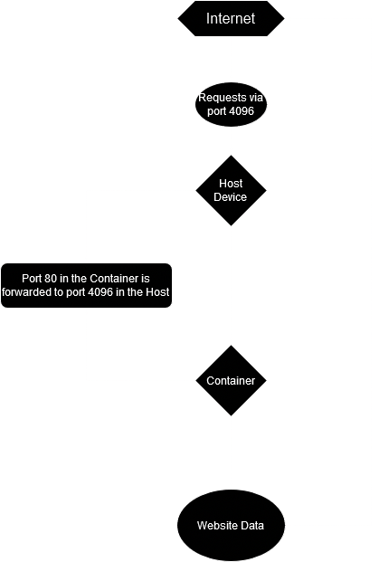
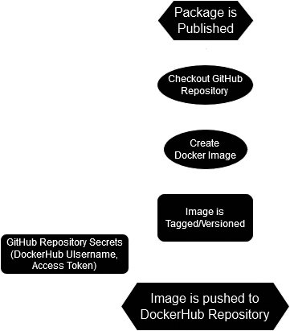

## An Overview of the Project
I'm making a container in Docker for a simple webpage.

## How to Run the Project
- First, I downloaded [Docker Desktop](https://www.docker.com/products/docker-desktop/). The installer should take care of any dependencies.
- Then, after a few computer restarts, I make sure Docker Desktop is open
  - No really, make sure Docker Desktop is open
- From there, I open up Command Prompt and set my working directory to `website`.
- Then, I run `docker build . -t imagename` to create the image, where:
  - `.` specifies the location to pull files from, including the `Dockerfile`. In this case, I'm using the current working directory.
  - `-t imagename` gives the resulting image the name `imagename`. (or whatever you decide to call it)
- After the image has been created, it can be run in Docker Desktop by clicking its `Run` button in the `Images` tab.
  - Or, if you want to be a NERD, run `docker run imagename -p 4096:80 --name containername --rm`, where:
    - `imagename` is the name of the image you want to run.
    - `-p 4096:80` forwards port 80 in the container to port 4096 on your host device.
    - `--name containername` goves the resulting container the name `containername`. (or whatever you decide to call it)
    - `--rm` removes the container's file system when the container exits.
      - As in, deletes everything inside the container. You aren't getting your logs back with this one
      - This doesn't delete the image or source files, however.
- Once the container is running, you can go to `hostdevicepublicip:port` to access your webpage.
  - `hostdevicepublicip` refers to the public IP address of your host device. (For example, `87.65.43.210`.)
  - If you're trying to access the webpage from the host device, you can use `localhost:port` instead.
  - The port you use to access the webpage is the same one that the container uses for the host device. (In this example, it's port 4096, so I would use `hostdevicepublicip:4096`.)

## Using DockerHub
- After signing in to [DockerHub](https://hub.docker.com/), I went to the Repositories tab and clicked "Create Repository".
- To use your DockerHub credentials in your CLI, use `docker login -u username`.
  - When asked for your password, enter it.
    - Or if you want to be a *cool* kid, set up an Access Token and use *that* instead.
- To push an image to DockerHub from your CLI, use `docker push username/repo-name:tagname`
  - For me, it's `docker push radzo73/test-repo:tagname`, since my DockerHub repo is [here](https://hub.docker.com/r/radzo73/test-repo).
- To set up a GitHub Secret, go to your repo and click the "Settings" tab.
  - From there, expand the "Secrets and Variables" tab and click on "Actions".
- Then, click on "New Repository Secret".
  - The two secrets you need to set up for automated DockerHub pushing are:
    - `DOCKER_USERNAME` (your DockerHub username)
    - `DOCKER_PASSWORD` (Preferrably an Access Token with at least Read/Write permissions)
- Now, we set up the Action workflow.
  - In your repo, click on the "Actions" tab.
- You will be presented with a list of recommended Actions.
  - If you can't find `Docker image` in that list, then you can search for it.
- While the template is helpful, it needs a few changes.
  - Importantly, it needs your `DOCKER_USERNAME` and `DOCKER_PASSWORD` secrets for authentication.

## Diagrams
For accessing the website:

For creating a Docker Image to the DockerHub Repository:

